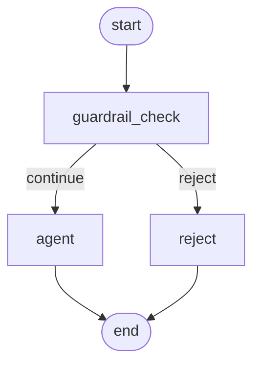
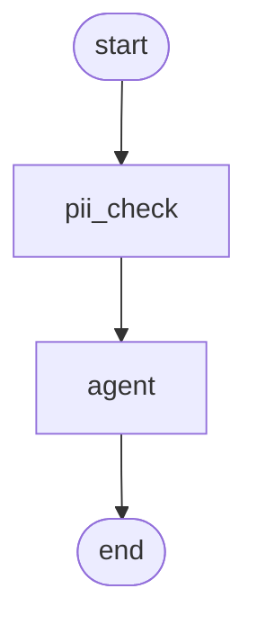
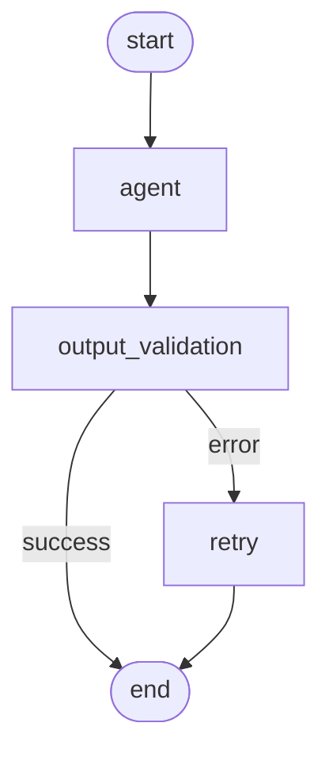
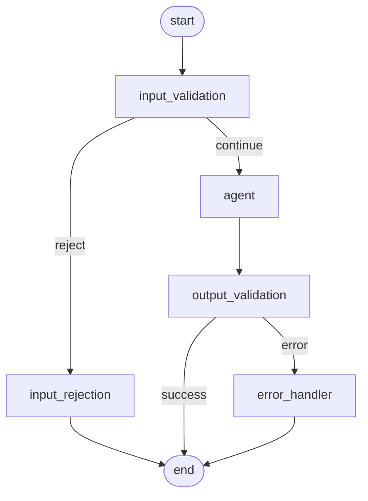

# LangGraph Guardrails Implementation Guide

A comprehensive guide and reference implementation for implementing guardrails in LangGraph workflows. This repository provides practical patterns and examples that go beyond basic documentation.

## Why This Repository?

The official LangGraph guardrails examples are minimal and don't cover real-world use cases. This repository provides:

- **Multiple guardrail patterns** (input validation, output filtering, content safety)
- **Production-ready implementations** with proper error handling
- **Composable guardrail system** that can be combined
- **Clear explanations** of when and how to use each pattern
- **Working examples** you can run and adapt

## What Are Guardrails?

Guardrails are validation and safety mechanisms that control what your LangGraph agent can process and output. Unlike LangChain's middleware-based approach, LangGraph guardrails are implemented as **nodes and conditional edges** in your graph.

### Types of Guardrails

#### 1. **Input Guardrails** (Pre-processing)
Validate and filter input before it reaches your agent:
- Content filtering (profanity, sensitive topics)
- Input format validation
- PII detection and redaction
- Topic/domain validation

#### 2. **Output Guardrails** (Post-processing)
Validate and filter agent responses before returning to users:
- Content safety checks
- Factuality validation
- PII scrubbing from outputs
- Response format validation

#### 3. **Loop Guardrails** (Continuous)
Monitor and control the agent during execution:
- Token/cost limits
- Time limits
- Loop detection
- Tool usage restrictions

## Implementation Patterns

### Pattern 1: Conditional Routing (Simple)

```python
def input_guardrail(state: State) -> Literal["reject", "continue"]:
    if not is_safe(state["input"]):
        return "reject"
    return "continue"

workflow.add_node("guardrail", guardrail_check)
workflow.add_conditional_edges("guardrail", input_guardrail, {
    "reject": "rejection_message",
    "continue": "agent"
})
```

**Use when:** Simple binary decisions (safe/unsafe, valid/invalid)

### Pattern 2: State Transformation (Modify)

```python
def pii_redaction_guardrail(state: State) -> State:
    """Redact PII from input"""
    redacted_input = redact_pii(state["input"])
    return {"input": redacted_input, "pii_found": True}

workflow.add_node("pii_guardrail", pii_redaction_guardrail)
workflow.add_edge("pii_guardrail", "agent")
```

**Use when:** You need to modify the input/output rather than reject it

### Pattern 3: Multi-Layer Validation (Comprehensive)

```python
def multi_layer_guardrail(state: State) -> Literal["reject_unsafe", "reject_offtopic", "continue"]:
    if not is_content_safe(state["input"]):
        return "reject_unsafe"
    if not is_on_topic(state["input"]):
        return "reject_offtopic"
    return "continue"
```

**Use when:** Multiple validation criteria with different rejection messages

### Pattern 4: LLM-Based Guardrails (Semantic)

```python
from guardrails.safety_guardrails import ContentSafetyGuardrail
from guardrails.config import create_anthropic_llm

# Use Claude 4.5 Haiku for fast, accurate content safety checking
llm = create_anthropic_llm()  # Loads from .env file

safety_guardrail = ContentSafetyGuardrail(
    llm=llm,
    safety_categories=["violence", "hate", "sexual", "self-harm"],
    threshold=0.7
)

workflow.add_node("safety_check", safety_guardrail.check)
```

**Use when:** Rule-based checks aren't sufficient; need semantic understanding

**Why Claude 4.5 Haiku?**
- Fastest: Anthropic's fastest model for real-time guardrail validation
- Cost-effective: $1 per million input tokens, $5 per million output tokens
- Powerful: Matches Sonnet 4 performance on coding and agent tasks
- Accurate: Excellent at classification, safety checks, and content moderation
- Context-aware: Understands nuance better than keyword matching

## Visual Graph Representations

All examples include visual workflow diagrams showing how guardrails integrate into your LangGraph flows:

### Simple Input Guardrail


### PII Redaction Flow


### Output Validation with Retry


### Production Multi-Layer System


**Generate your own diagrams:**
```bash
python generate_diagrams.py
# Creates Mermaid diagrams in docs/diagrams/
```

View diagrams at [mermaid.live](https://mermaid.live) or with VS Code Mermaid extension.

## Repository Structure

```
langgraph-guardrails-example/
├── README.md                          # This file
├── QUICKSTART.md                      # Quick start guide
├── requirements.txt                   # Dependencies
├── .env.example                       # Environment variables template
├── generate_diagrams.py               # Generate workflow visualizations
├── guardrails/
│   ├── __init__.py
│   ├── base.py                       # Base guardrail classes
│   ├── config.py                     # Configuration & LLM setup (Claude 4.5 Haiku)
│   ├── input_guardrails.py           # Input validation guardrails
│   ├── output_guardrails.py          # Output filtering guardrails
│   ├── safety_guardrails.py          # Content safety guardrails
│   ├── llm_guardrails.py             # Flexible LLM-based guardrails with custom prompts
│   ├── visualization.py              # Graph visualization utilities
│   └── utils.py                      # Helper functions
├── examples/
│   ├── 01_simple_input_guardrail.py  # Basic input validation
│   ├── 02_pii_redaction.py           # PII detection and redaction
│   ├── 03_output_validation.py       # Response validation
│   ├── 04_multi_layer.py             # Combined guardrails
│   ├── 05_llm_based_safety.py        # LLM-powered safety checks (Claude 4.5 Haiku)
│   ├── 06_production_example.py      # Full production setup
│   └── 07_custom_llm_guardrails.py   # Custom LLM guardrails with flexible prompts
└── docs/
    └── diagrams/                     # Generated Mermaid diagrams
```

## Quick Start

### Installation

```bash
# Clone the repository
git clone <your-repo-url>
cd langgraph-guardrails-example

# Install dependencies
pip install -r requirements.txt

# Optional: Set up environment for LLM-based guardrails
cp .env.example .env
# Edit .env and add your ANTHROPIC_API_KEY
```

### Basic Example

```python
from langgraph.graph import StateGraph, END
from guardrails.input_guardrails import TopicValidationGuardrail

# Define your state
class State(TypedDict):
    input: str
    messages: list

# Create guardrail
topic_guardrail = TopicValidationGuardrail(
    allowed_topics=["weather", "climate"]
)

# Build graph
workflow = StateGraph(State)
workflow.add_node("validate", topic_guardrail.check)
workflow.add_node("agent", your_agent_node)
workflow.add_node("reject", lambda s: {"messages": ["Sorry, off-topic"]})

workflow.set_entry_point("validate")
workflow.add_conditional_edges("validate", topic_guardrail.route, {
    "valid": "agent",
    "invalid": "reject"
})
workflow.add_edge("agent", END)
workflow.add_edge("reject", END)

graph = workflow.compile()
```

### Custom LLM Guardrail Example

For more flexible, context-aware validation using Claude 4.5 Haiku:

```python
from guardrails.llm_guardrails import LLMGuardrail
from guardrails.config import create_anthropic_llm

# Create a custom guardrail with your own prompt
brand_guardrail = LLMGuardrail(
    llm=create_anthropic_llm(),
    system_prompt="You are a brand safety expert.",
    instruction_template="""Check if this content aligns with our brand values:
    - Professional and respectful
    - Family-friendly
    - No controversial topics

    Content: {content}

    Respond with JSON: {{"is_safe": bool, "reason": str, "confidence": float}}
    """,
    threshold=0.8
)

# Use it like any guardrail
workflow.add_node("brand_check", brand_guardrail.check)
```

**Benefits over keyword matching:**
- Understands context and nuance
- Adapts to complex rules via natural language
- Can validate tone, intent, factuality
- More maintainable (change prompt, not code)

**When to use:**
- Complex, domain-specific validation
- Tone/style checking
- Fact-checking against knowledge base
- Brand safety and compliance

See `examples/07_custom_llm_guardrails.py` for complete examples including:
- Custom policy enforcement
- Brand safety validation
- Tone checking
- Code review guardrails

## Key Differences from LangChain Guardrails

| Feature | LangChain | LangGraph |
|---------|-----------|-----------|
| **Implementation** | Middleware/decorators | Nodes + conditional edges |
| **Abstraction Level** | High-level chains | Low-level graph control |
| **Flexibility** | Limited to pre/post hooks | Full control over flow |
| **Composability** | Sequential only | Complex routing |
| **State Management** | Limited | Full state access |

## Best Practices

### 1. **Layer Your Guardrails**
Start with cheap, fast checks (regex, keywords) before expensive ones (LLM calls):

```python
workflow.add_node("quick_filter", regex_guardrail)
workflow.add_node("llm_safety", llm_guardrail)
workflow.add_edge("quick_filter", "llm_safety")
```

### 2. **Return Helpful Error Messages**
Don't just reject - explain why:

```python
def rejection_node(state: State) -> State:
    reason = state.get("rejection_reason", "unknown")
    return {
        "messages": [f"Cannot process: {reason}"],
        "rejected": True
    }
```

### 3. **Track Guardrail Metrics**
Log what's being caught for monitoring:

```python
def guardrail_with_metrics(state: State) -> State:
    result = check_safety(state["input"])
    if not result.safe:
        log_metric("guardrail_triggered", {"reason": result.reason})
    return state
```

### 4. **Make Guardrails Configurable**
Use LangGraph's config system:

```python
class GraphConfig(TypedDict):
    safety_level: Literal["strict", "moderate", "permissive"]

workflow = StateGraph(State, config_schema=GraphConfig)
```

### 5. **Test Your Guardrails**
Create test cases for both valid and invalid inputs:

```python
def test_guardrail():
    state = {"input": "malicious input"}
    result = guardrail(state)
    assert result["rejected"] == True
```

## Advanced Topics

### Async Guardrails
For I/O-bound checks (API calls, database lookups):

```python
async def async_pii_check(state: State) -> State:
    pii_detected = await pii_detection_api.check(state["input"])
    return {"has_pii": pii_detected}
```

### Composable Guardrails
Chain multiple guardrails together:

```python
class GuardrailChain:
    def __init__(self, guardrails: list):
        self.guardrails = guardrails

    def check(self, state: State) -> State:
        for guardrail in self.guardrails:
            state = guardrail.check(state)
            if state.get("rejected"):
                break
        return state
```

### Conditional Guardrails
Apply different guardrails based on context:

```python
def select_guardrail(state: State) -> str:
    if state["user_type"] == "premium":
        return "lenient_guardrail"
    return "strict_guardrail"

workflow.add_conditional_edges("input", select_guardrail)
```

## Examples

See the `examples/` directory for runnable code covering:
1. **Simple Input Guardrail** - Basic topic validation
2. **PII Redaction** - Detect and redact sensitive information
3. **Output Validation** - Ensure responses meet criteria
4. **Multi-Layer** - Combine multiple guardrails
5. **LLM-Based Safety** - Use LLMs for semantic safety checks
6. **Production Example** - Full featured production setup

## Contributing

This is a reference implementation to help the community. Feel free to:
- Open issues for questions or suggestions
- Submit PRs with additional guardrail patterns
- Share your own implementations

## Resources

- [LangGraph Documentation](https://langchain-ai.github.io/langgraph/)
- [LangChain Guardrails (v1.0)](https://docs.langchain.com/oss/python/langchain/guardrails)
- [Original LangGraph Guardrails Example](https://github.com/langchain-ai/langgraph-guardrails-example)

## License

MIT
